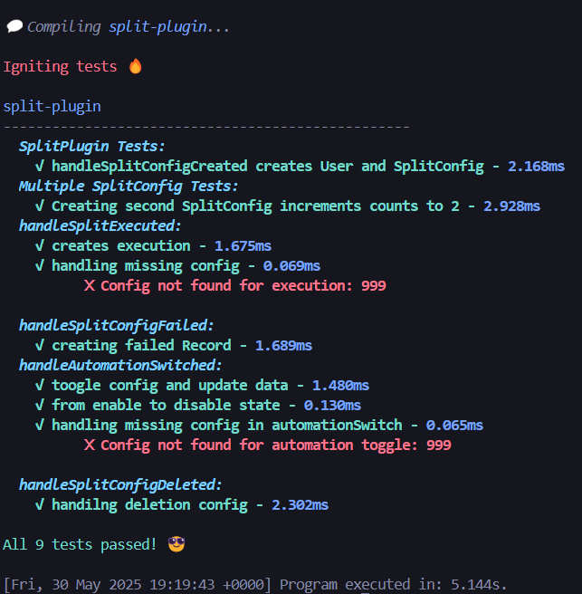

# SplitPlugin Subgraph  

A subgraph for indexing and querying historical data related to **SplitPlugin**, enabling users to track their split configurations, executions, and recipient distributions on-chain.  

🔗 **Deployed Subgraph Link:**  
[https://api.studio.thegraph.com/query/112614/split-plugin/0.0.1](https://api.studio.thegraph.com/query/112614/split-plugin/0.0.1)  

## Example Queries

Example GraphQL queries are available in [`Queries.graphql`](./Queries.graphql). These demonstrate common use cases for fetching:

- User configurations
- Split execution history
- Recipient payout details
- Failed transaction analysis


## 📌 Overview  
This subgraph indexes events and state changes from the **SplitPlugin** smart contracts, providing structured access to:  
- User split configurations  
- Recipient allocations  
- Execution history (successful/failed)  
- Automation toggles and config updates  


## 🚀 Quick Start  

### Testing  
Verify subgraph logic with:  
```bash
npm test
```

## 💡To improve indexing efficiency and data granularity

To improve efficiency, there are a few things that, if implemented, can make subgraph development more effective.

### 1. Emit Events for Config Updates
**Current scenario**:  
Requires call handlers (prone to rate limits)  
✅ **Suggestion**:  
Add `SplitConfigUpdated` events when configurations change

### 2. Track Distributed Amounts  
**Current scenario**:  
Unable to index historical payout amounts per recipient  
✅ **Suggestion**:  
Include `amountDistributed` in execution events

